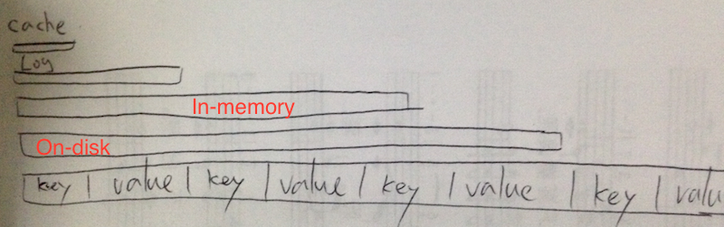
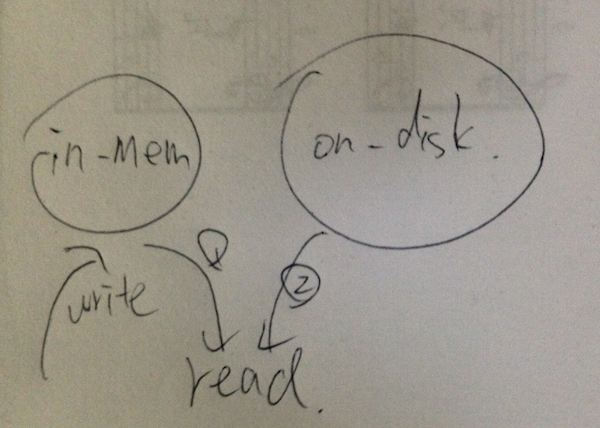
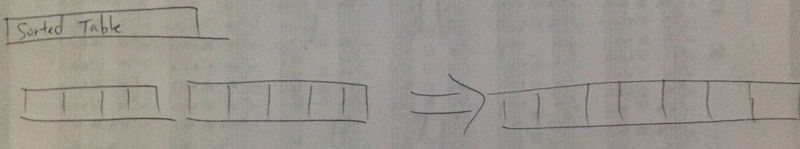

class: middle, center
# LevelDB


--

.left[## Why?]

---

## Brief Intro
--

- BigTable: most codebases are not open-sourced
--

- leveldb: same idea but open-sourced (originally by Jeffery Dean and Sanjay Ghemawat)
--


## Main features
--

- Key-value storage
--

- Arbitrary data
--

- Compressed storage ([Snappy](https://code.google.com/p/snappy/) compression library)
--

- Sorted keys

---

## How does it store data?

Combine writable in-memory table with read-only on-disk table

---

## How does it store data?

- writes only goes to in-memory table
--

- read from in-mem first, then on-disk
--

- read-only once save it on dist
--


---

## How does it store data?

- merge on-disk tables to a larger one



---

## Benefit
--

- Fast write (in-memory)
--

- Fast read (sorted & read-only)

--

### Good for data with orders
---

## Operations

- put
- get

```javascript
db.put("myKey", "mySecret", function(){
  db.get("myKey", function(err, data){
    console.log(data); //mySecret
  });
});
```

--

- del

---

## Operations

- batch: Array type

```javascript
db.batch([
  {
    type: 'put',
    key: 'hello',
    value: 'world'
  },
  // ...
], function(){});
```

--

- batch: Chain type

```javascript
db.batch()
  .put(1234, { _id: 'jjjj' })
  .put(1923, { _id: 'gasa' })
  .del(1930)
  .write(function(){});
```

---

## Operation

- STREAM!

demonstration

---

## What it actually is:

- [LevelDB](https://github.com/google/leveldb), a C++ library that provides
sorted key-value storage

--

- has different language bindings
  - NodeJs
  - Python
  - Ruby
  - C#
  - ...

--

- for js developers, what make it shine is...

---

## The NodeJs binding

levelDB is **GREAT**, but its NodeJs binding is **AMAZING**

--

- made by great node guru ([Rod Vagg](https://github.com/rvagg)), pure
node-style **(unlike the most popular redis binding...)**

--

- Interface: [levelUp](https://github.com/rvagg/node-levelup)
- Backend: [levelDown](https://github.com/rvagg/node-leveldown)

--

- [AbstractLevelDownAPI](https://github.com/rvagg/abstract-leveldown) makes
extending LevelDB much easier

--

- [Ecosystem](https://github.com/rvagg/node-levelup/wiki/Modules)

---

## Real world usage

- IndexedDB in Chrome
- ActiveMQ
- Riak

---

## Wrapup: The WHY

- zero deployment

--

- interface and backend are highly separated

--

  - migration cost is little

--

  - extensibility: nodeJs and Unix philosophy!

--

  - Developer v.s Administrator
